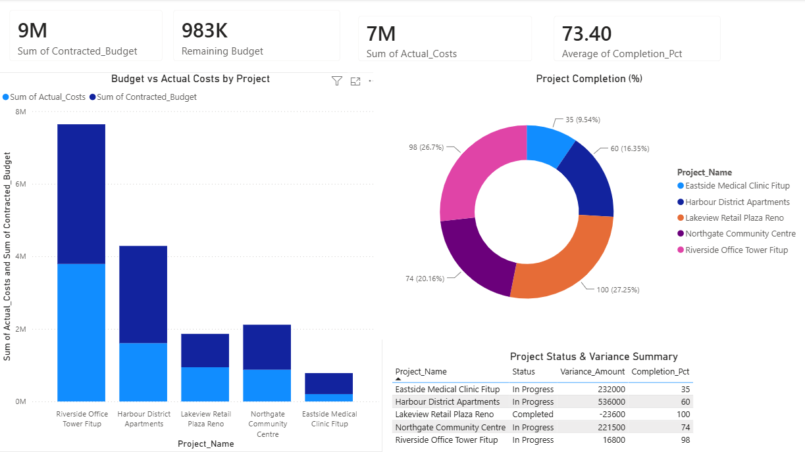

# Construction Portfolio Financial Tracker — Power BI Dashboard

## Dashboard Preview

## Key Insights

- **Total Portfolio Value:** $9.3M CAD
- **Budget Utilization:** ~73% across the portfolio
- **Variance Range:** -$23,600 to +$536,000
- **Project Status:** 4 active, 1 completed
